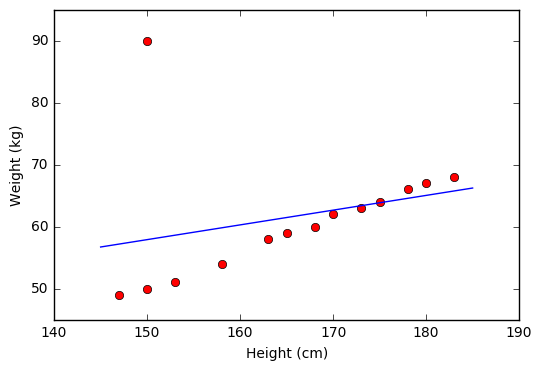

# 1.Phát biểu bài toán
Giả sử chúng ta xét phương trình hồi qui đơn biến gồm $\mathbf n$ quan sát có biến phụ thuộc là: 
 $$\mathbf{y} = \{y_1, y_2,..., y_n\}$$
 và biến đầu vào:
 $$\mathbf{x} = \{x_1, x_2,...,x_n\}$$
Phương trình hồi qui tuyến tính đơn biến có dạng:
$$\hat{y_i} = f(x_i) =\theta_1*x_i+\theta_0$$
$(x_i,y_i)$ đại diện cho điểm dữ liệu thứ $i$.\
Trong đó
$$\theta=(\theta_0,\theta_1)$$
là tham số của mô hình. $\theta_1$ là hệ số góc, $\theta_0$ là hệ số ước lượng.\
# 2. Hàm mất mát (Loss Funtion)
## 2.1. Hàm MSE ( Tổng bình phương sai số)
$$\mathcal{L}(\mathbf{w}) = \frac{1}{2n} \sum_{i = 1}^{n}(y_i - \hat{y_i})^2 = \frac{1}{2n} \sum_{i = 1}^{n}(y_i - \theta_0 - \theta_1 *  x_i)^2$$
- $\frac{1}{2}$ được thêm vào nhầm triệt tiêu số mũ khi ta đạo hàm 
- Bình phương đại diện cho khoảng cách giữa 2 điểm dữ liệu là không âm

## 2.2 Tối thiểu hàm mất mát
Hàm mất mát chính là hàm MSE ở mục 2.1, ta cần tối thiểu hóa hàm này bằng cách tính đạo hàm và cho bằng 0.
- Đạo hàm theo $\theta_0$ và giải phương trình đạo hàm riêng bằng 0:
- Thế vào phương trình (2) ta tính được:

## Thuật toán LMS ( Xuống đồi bằng đạo hàm)
Chúng ta cần chọn ra $w$ để cực tiểu hóa hàm $\mathcal{L(w)}$, thông thường giá trị bắt đầu sẽ là $w_0$ và cập nhật $w$ theo công thức dưới đây:
$$w_j=w_j- \alpha \frac{\partial}{\partial w_j}L(w),\forall j=0,1,...d $$
Trong đó $d$ là số chiều của dữ liệu.
# 3. Tổng kết
## 3.1 Hạn chế của hồi quy tuyến tính
Hạn chế đầu tiên của Linear Regression là nó rất nhạy cảm với nhiễu (sensitive to noise). Trong ví dụ về mối quan hệ giữa chiều cao và cân nặng bên trên, nếu có chỉ một cặp dữ liệu nhiễu (150 cm, 90kg) thì kết quả sẽ sai khác đi rất nhiều. Xem hình dưới đây:

